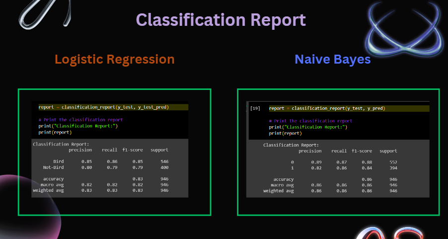

# Wildlife-Vocalization-Classification-for-Conservation-Monitoring
Machine Learning Project

A project based on audio analysis and detection of birds in Audio clips

# About the Dataset

The dataset consists of 10 second audioclips
A portion of the audio clips consists of bird sounds, and the and the rest consists of other miscellanious sounds
Features are extracted from the Audio clips and processed to make it fit for the models presented

The features consist of:
Spectral_Centroid
Spectral_Bandwidth
Spectral_Contrast
Spectral_Rolloff
Chroma
Spectral_Flatness
Zero_Crossing_Rate
HNR
The dataset has 4730 values and 11 columns

# Comparative Analysis | Logistic Regression | Naive Bayes

oth Logistic Regression and Naive Bayes are popular algorithms for binary classifiation, but they have different underlying assumptions and characteristics.

Naive Bayes is based on Bayes' theorem and assumes that features are conditionally independent given the class label. It's computationally efficient and can handle high-dimensional data effectively. 

Naive Bayes is also less prone to overfitting, which can be advantageous when dealing with limited amounts of data.

Naive bayes:  Train-Test Accuracy 87% and  86%
Logistic Regression: Train-Test Accuracy 83% and 82%

# Group Members
Purnima Rangavajjula, Sabhya Raj Mehta, Gowri Krishnadas, Ayush Binil Nair

